[TOC]

+ 高性能Key-value服务器
+ 多种数据结构
+ 丰富的功能
+ 高可用分布式支持

Redis 开源 基于键值的存储服务系统 高性能、功能丰富

速度快，持久化，多种数据结构，多语言支持(java php python ruby lua nodejs)，简单，功能丰富

1.速度快

10w ops(每秒十万)

存在内存中,c语言（50000line）离操作系统较近,单线程

寄存器 一级缓存 二级缓存 内存 本地硬盘 远程硬盘

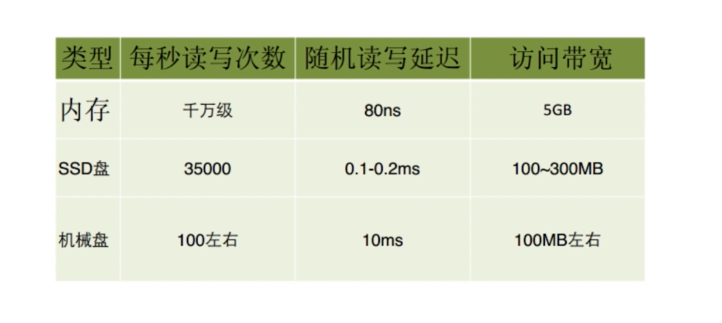

2.持久化（断电不丢数据）

redis将所有数据保存在内存中，对数据的更新异步保存在磁盘上

3.多种数据结构

Strings/Blobs/Bitmaps

HashTables(objects)

Linked Lists

Sets

Sorted Sets

(BitMaps)位图 (HyperLogLog)超小内存唯一值计数 (GEO)地理信息定位

4.多种功能

发布订阅 事务 lua脚本 pipline（管道技术）

6.简单

不依赖外部库

单线程模型

7.主从复制

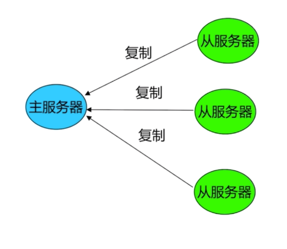

8.高可用、分布式

高可用 =》 redis-sentinel(v2.8)支持高可用

分布式 =》redis-cluster(v3.0)支持分布式


使用场景：

+ 缓存系统 redis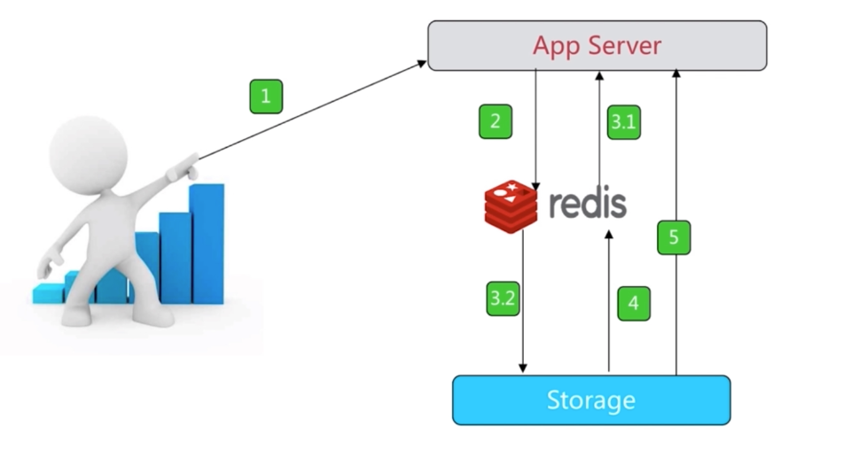
+ 计数器 (转发评论数统计)
+ 消息队列系统 （中间件 rabbitmq kafka）
+ 排行榜 
+ 社交网络 （粉丝数关注数等）
+ 实时系统 （垃圾邮件处理系统）


6379(MERZ) 意大利歌女Alessia Merz的名字

config get *

Redis-server --port 6380

ps -ef | grep redis-server

cat redis-6381.conf| grep -v "#" | grep -v "^$"


通用命令（单线程架构，数据结构和内部编码）

keys [pattern]   热备从节点, dbsize, exists(判断是否存在) key, del key, expire key seconds,ttl key(查看还有多少时间过期),persist key(去掉过期时间),  type key (string hash list set zset)

时间复杂度：**keys** O(n), **dbsize** O(1), **del** O(1), **exists** O(1),  **expire** O(1),  **type** O(1)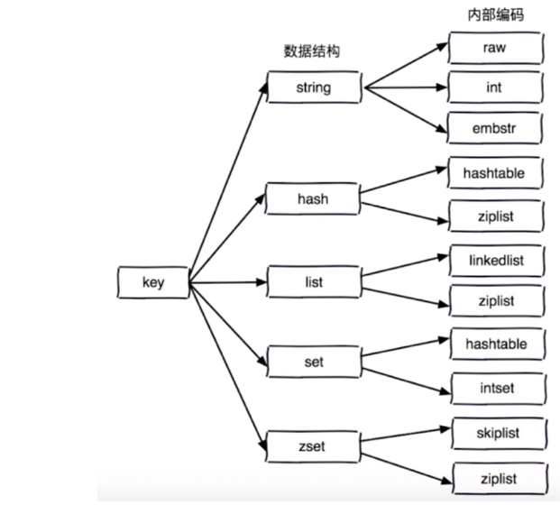

**单线程**为什么这么快？纯内存（主要原因），非阻塞IO，避免线程切换和竞态消耗

+ 一次只运行一条命令
+ 拒绝长（慢）命令  **keys**, **flushall**, **flushdb**, **slow lua script**, **mutil/exec**, **operate big value(collection)**
+ 其实不是单线程 fysnc file descriptor , close file descriptor

### 字符串类型  

(缓存，计数器，分布式锁，and so on)

**get**, **set**, **del**       O(1)

**incr** key, **decr** key, **incrby** key n, **decrby** key n    O(1)(key不存在均会自动创建后增加或减少)

记录网站访问量 incr userid:pageview(计数器)

缓存视频的基本信息伪代码

（原子单线程）incr id(原子操作)

**set**    **setnx**(不存在时执行)   **set** key value **xx**（存在时执行） O(1)

**mget**, **mset**  O(n)

n次get = n次网络时间+n次命令时间

1次mget = 1次网络时间 + n次命令时间

**getset**      **append**      **strlen**   O(1)(中文长度会有变化)

**incrbyfloat**  key 3.5   (浮点数的自增), **getrange** key start end (start和end都可以取到), **setrange** key index value  O(1) 

### 哈希

key field value

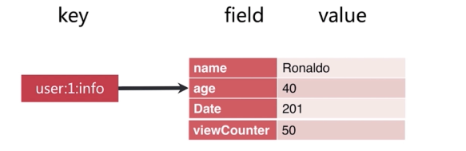

**hget**     **hset**   **hsetnx**    **hdel**    O(1)

**hexists** key field,    **hlen**  key

**hmset**  key field1 value1 field2 value2 , **hmget ** key field1 field2

**hincrby** user:1:info pageview count  **hincrbyfloat**    O(1)

**hgetall**    **hvals**    **hkeys**    O(n)

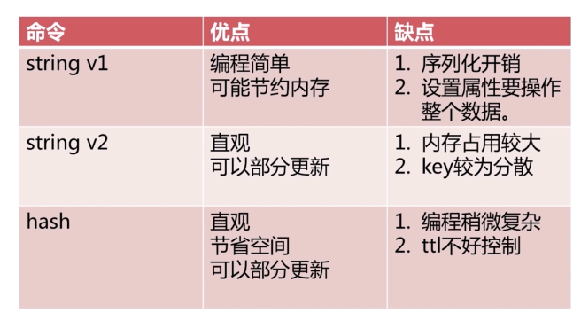

### 列表

有序，可重复，左右两边插入弹出

**lpush** key,   **lpop **  O(1),  **rpush** key v1 v2 v3  O(1~n),   **rpop**

**linsert** key before|after value newValue  O(n)  插入

**lrem** key count value    (count > 0 从左往右, 删除count个；count < 0 从右往左删除abs（count）个；count = 0,删除全部值等于value的)  O(n)

**ltrim** key start end O(n)  截取list（大的列表删除）(在本身操作)

**lrange** key start end

**lindex** key index

**llen** key 获取列表长度 O(1)

**lset** key index newValue   O(n) 

pop的阻塞版本，timeout是阻塞的超时时间，timeout=0为永远不阻塞

**blpop** key timeout O(1)

**brpop** key timeout O(1)

+ LPUSH+LPOP  = STACK
+ LPUSH+RPOP = QUEUE
+ LPUSH+LTRIM = CAPPED COLLECTION （覆盖，限制大小）
+ LPUSH+BRPOP = message queue

时间轴功能实现

### 集合

无序   无重复    集合间操作

**sadd** key element(可以多个)  O(1)

**srem** key element(可以多个)  O(1)

**scard** key 计算集合大小

**sismember** key element 判断元素是否存在

**srandmember** key count 从集合中随机挑选count个元素

**spop** key 从集合中随机弹出一个元素

**smembers** 获取所有的集合元素 (可能造成堵塞)

抽奖系统   Like、赞、踩   标签(tags)

**sdiff** 差集

**sinter** 交集

**sunion** 并集

**sdiffstore|sinterstore|sunionstore**   result set1 set2

共同关注的好友

### 有序集合

key score value

**zadd** key score element(可以是多对) O(logN)

**zrem** key element（可以多个） O(1)

**zscore** key element

**zincrby** key increScore element

**zcard** key

**zrange** key start end [WITHSCORES]  O(log(n)+m)

**zrangebyscore** key min max [withscores]   O(log(n)+m)

**zcount** key min max  O(log(n)+m)

**zremrangebyrank** key start end 删除制定排名内升序元素

**zremrangebyscore** key min max  O(log(n)+m) 删除指定范围内

**zrank** key member 获得元素的序号

排行榜    

**zrevrank**  降序的index

**zrevrange**  降序的范围

**zrevrangebyscore**

**zinterstore**

**zunionstore**


Jedis客户端

**jedis直连**

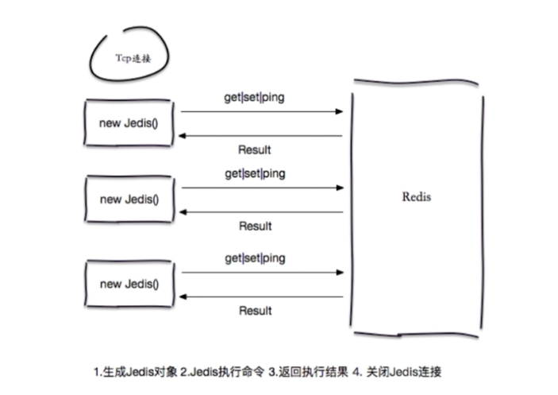

**Jedis连接池**

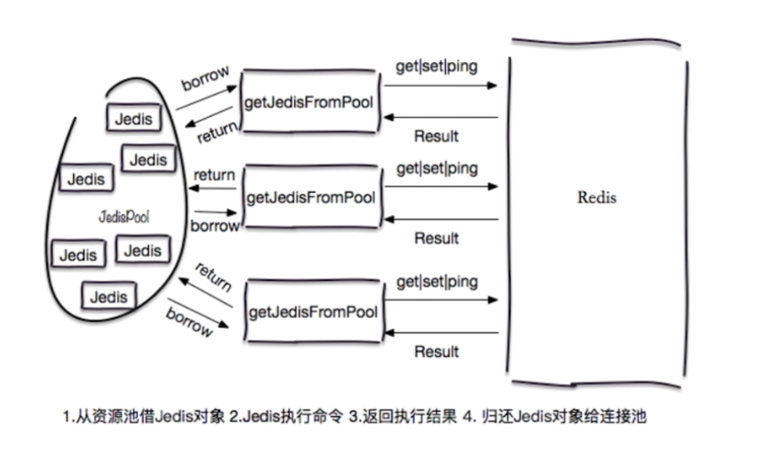

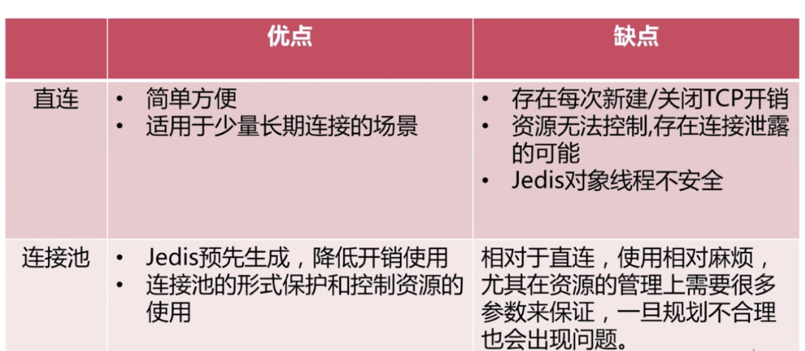


### 慢查询

生命周期，慢查询发生在步骤三，慢查询式客户端超时的可能因素，但超市不代表一定慢查询

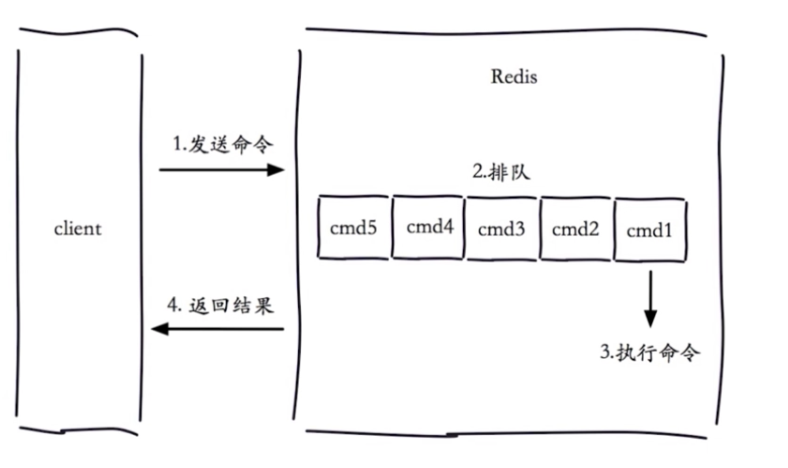

Slowlog-max-len

+ 先进先出
+ 固定长度
+ 保存在内存中

Slowlog-log-slower-than

+ 慢查询阈值（微秒）
+ Slowlog-log-slower-than=0, 记录所有命令
+ Slowlog-log-slower-than<0, 不记录任何命令

1、默认值

+ config get slowlog-max-len = 128
+ config get slowlog-log-slower-than = 10000

2、修改配置文件重启

3、动态配置 

slowlog get[n] : 获取慢查询队列

slowlog len ：获取慢查询队列长度

slowlog reset : 清空慢查询队列

**运维经验**

Slowlog-max-len 不要设置过大 默认10ms，通常设置1ms

Slowlog-log-slower-than 不要设置过小，通常1000左右

理解命令生命周期

定期持久化慢查询（如存到mysql）


### pipline 流水线

Mset mget hmset hmget (网络请求时间占请求的大头)   redis请求是微秒级别的


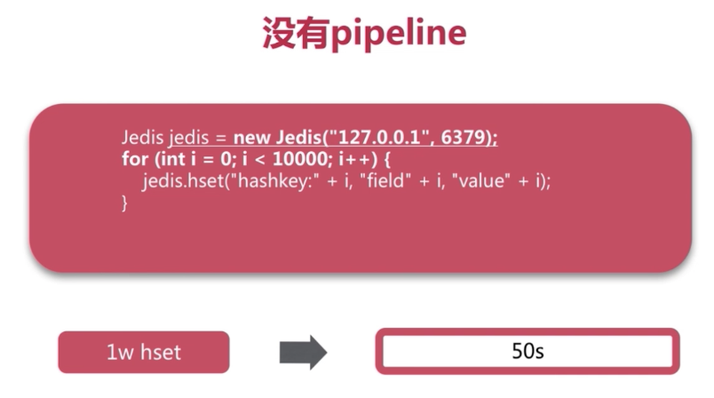

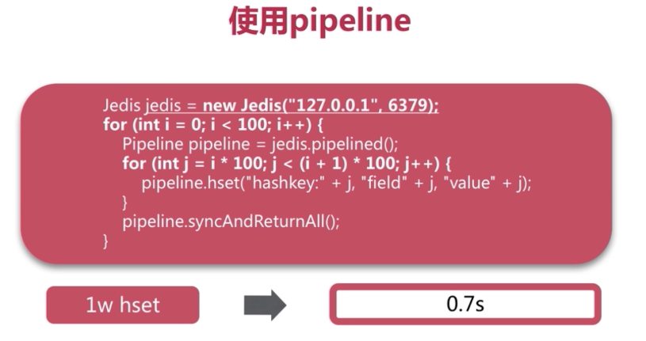

与原生M操作的区别

| 原生m操作 | pipline    |
| --------- | ---------- |
| 原子操作  | 非原子操作 |

 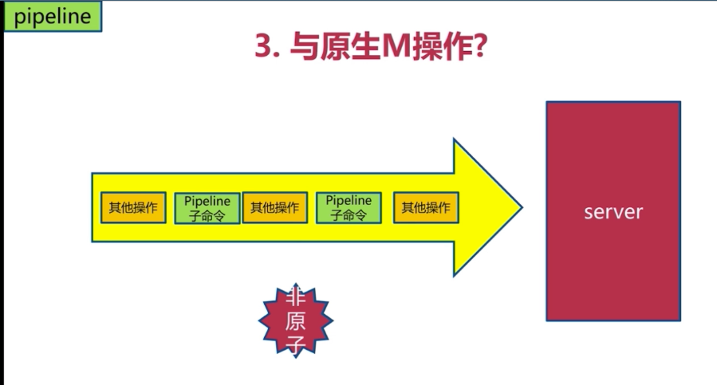

+ 注意每次pipline携带数据量
+ pipline每次只能作用在一个redis节点上
+ M操作和pipline的区别

### 发布订阅

角色

发布者，订阅者，频道

**publish** channel message

**subscribe** [channel]#可以是多个

**unsubscribe** [channel]

**psubscribe** [pattern] 模式订阅

**punsubscribe** [pattern] 模式退订

**pubsub** channels 列出至少有一个订阅者的频道

**pubsub** numsub [channel] 列出给定频道的订阅者数量

消息队列和发布订阅的区别？

### bitmap

**getbit** key offset

**setbit** key offset value

**bitcount** key [start end] 获取间隔内1的个数

**bitop** op destkey key [key....]   (op=and交集, or并集, not非, xor异或)  操作会保存在destkey中

**bitpos** key targetBit [start [end]]  计算位图指定范围（start到end，单位为**字节**(贼坑1字节等于8bit)， 如果不指定就是获取全部）第一个偏移量对应的值等于targetBit(0/1)的位置   返回的是位置

 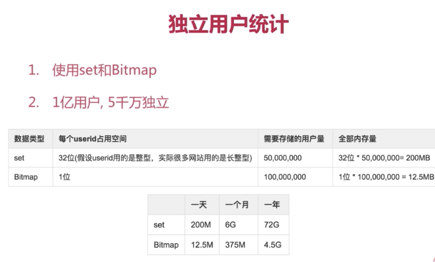

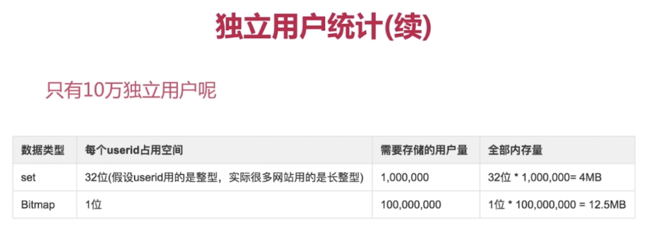

+ type=string,最大512MB
+ 注意setbit偏移量，可能有较大消耗
+ 位图不是绝对好的

### HyperLogLog

基于hyperloglog算法：极小空间完成独立数量统计

type=string

**pfadd** key element [element] 向hyberloglog添加元素 （会自动去重）

**pfcount** key [key...] 计算hyperloglog的独立总数

**pfmerge** destkey sourcekey [sourcekey...]  合并多个hyperloglog

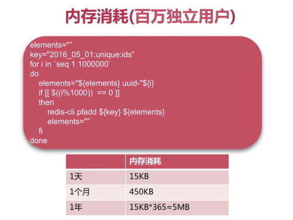

+ 是否能容忍错误？错误率：0.81%
+ 是否需要单条数据？ 不能取出单条数据

### GEO

经纬度存储，计算两地距离，范围计算等

**geoadd** key longitude latitude member   [longitude latitude member] 增加地理位置信息

**geopos** key member [member...] 获取地理位置信息

**geodist** key member1 member2 [unit] 获取两个地理位置的距离  #unit：m米，km千米，mi英里，ft尺

**georadius** key longitude latitude radius  m|km|ft|mi `[withcoord] [withdist] [withhash] [COUNT count] [asc|desc] [store key] [storedist key]` 

**georadiusbymember** key member longitude latitude radius   m|km|ft|mi `[withcoord] [withdist] [withhash] [COUNT count] [asc|desc] [store key] [storedist key]` 

withcoord：返回结果中包含经纬度

withdist：返回结果中包含距离中心节点位置

withhash：返回结果中包含geohash

COUNT count：指定返回结果的数量

asc|desc：返回结果按照距离中心节点的距离做升序或者降序

store key：将返回结果的地理位置信息保存到指定键

storedist key：将返回结果距离中心节点的距离保存到指定键

**for example**: georadiusbymember cities beijing 60 km

+ 在redis3.2+
+ type geoKey = zset
+ 没有专门用来删除的Api如果需要删除就用：zrem key member


### 持久化

快照 mysql dump/redis rdb

写日志 mysql binlog/hbase hlog/redis aof


### 缓存收益与成本

收益：

+ 加速读写
+ 降低后端负载：降低后端mysql负载等

成本：

+ 数据不一致：缓存层和数据层有时间窗口不一致，和更新策略有关
+ 代码维护成本： 多了一层缓存逻辑
+ 运维成本：例如Redis Cluster

使用场景：

+ 降低后端负载： 对高消耗的SQL：join结果集/分组统计结果缓存
+ 加速请求响应：急用redis和memcache优化IO响应时间
+ 大量写合并为批量写：如计数器先redis累加再批量写DB

### 缓存更新策略

1、LRU/LFU/FIFO算法剔除：例如maxmemory-policy

2、超时剔除：例如expire

3、主动更新：开发控制生命周期

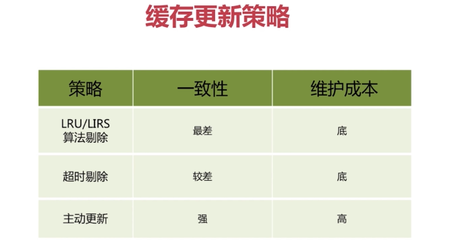

低一致性：最大内存和淘汰策略

高一致性：超时剔除和主动更新结合，最大内存和淘汰策略兜底


### 缓存粒度问题

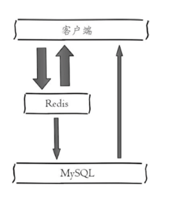

三个角度：

1、通用性：全量属性更好。

2、占用空间：部分属性更好。

3、代码维护：表面上全量属性更好。（大部分不需要全部）

### 缓存穿透问题

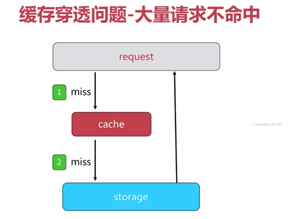

原因

+ 业务代码自身问题
+ 恶意攻击、爬虫等

如何发现

+ 业务的响应时间
+ 业务本身问题
+ 相关指标：总调用数、缓存层命中数、存储层命中数

解决方案1

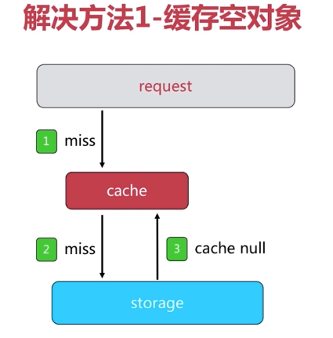

缺点：

1、需要更多的键

2、缓存层和存储层数据"短期"不一致

解决方案2 (数据集相对固定)

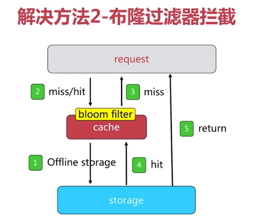

布隆过滤器（Bloom Filter）是1970年由布隆提出的。它实际上是一个很长的[二进制](https://baike.baidu.com/item/%E4%BA%8C%E8%BF%9B%E5%88%B6/361457)向量和一系列随机映射函数。布隆过滤器可以用于检索一个元素是否在一个集合中。它的优点是空间效率和查询时间都比一般的算法要好的多，缺点是有一定的误识别率和删除困难。

根据具体场景写实现方法


### 缓存雪崩

缓存层高可用、客户端降级、提前演练时解决雪崩问题的重要方法

缓存雪崩，即缓存同一时间大面积的失效，这个时候又来了一波请求，结果请求都怼到数据库上，从而导致数据库连接异常。

**缓存雪崩解决方案：**

- 给缓存的失效时间，加上一个随机值，避免集体失效。
- 使用互斥锁，但是该方案吞吐量明显下降了。
- 双缓存。我们有两个缓存，缓存 A 和缓存 B。缓存 A 的失效时间为 20 分钟，缓存 B 不设失效时间。自己做缓存预热操作。
- 然后细分以下几个小点：从缓存 A 读数据库，有则直接返回；A 没有数据，直接从 B 读数据，直接返回，并且异步启动一个更新线程，更新线程同时更新缓存 A 和缓存 B。

### 无底洞问题

2010年，facebook有了3000个Memcache节点

”加“机器性能没能提升，反而下降

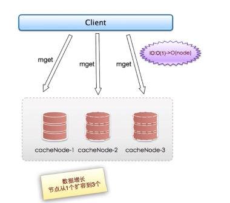

+ 更多的机器！=更高的性能
+ 批量接口需求（mget，mset等）
+ 数据增长与水平扩展需求

**优化IO的几种方法**：

1、命令本身优化：慢查询keys、hgetall bigkey

2、减少网络通讯次数

3、降低接入成本：客户端连接/连接池、NIO等

**四种批量优化的方法**：

串行mget

串行IO

并行IO

hash_tag

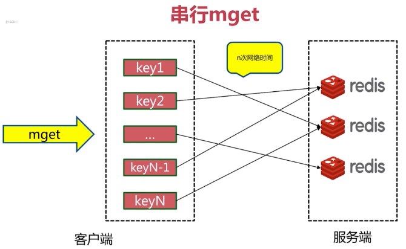

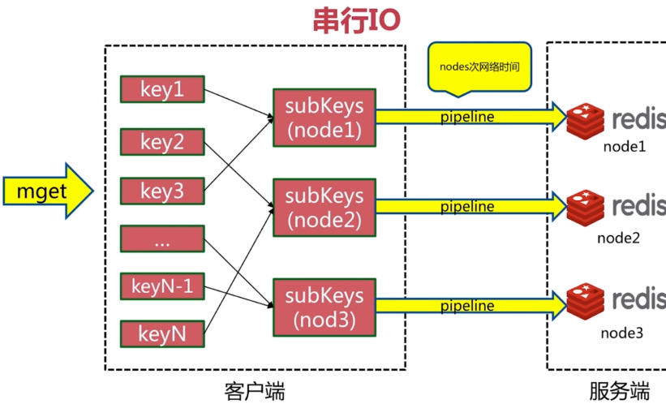

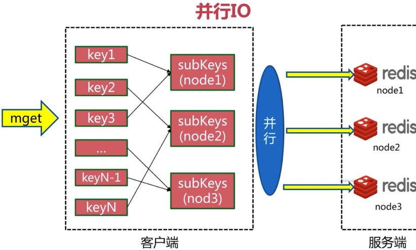

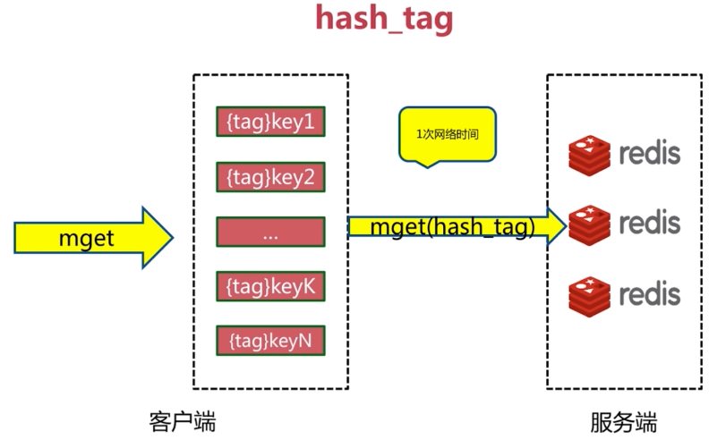

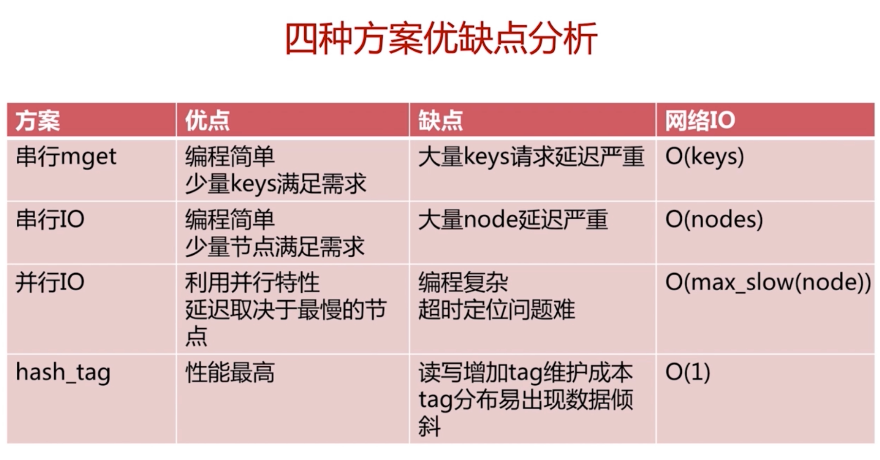

### 热点key重建优化

问题描述：热点key + 较长的重建时间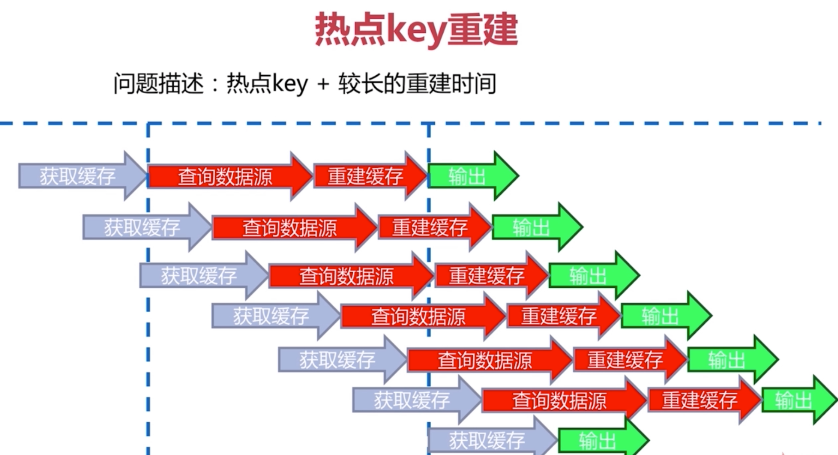

三个目标：

+ 减少重缓存的次数
+ 数据尽可能一致
+ 减少潜在危险

两个解决

+ 互斥锁（mutex key）
+ 永远不过期

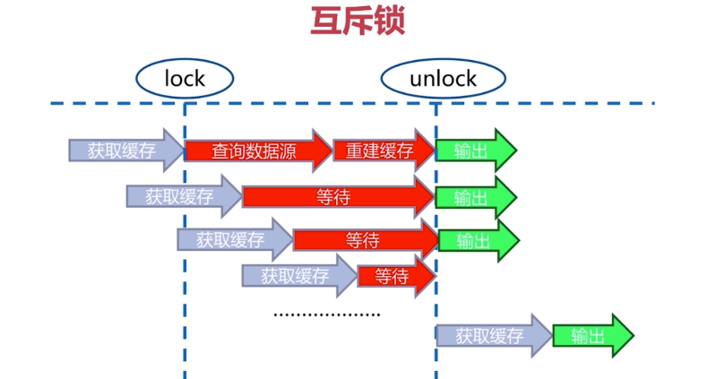

redis的expire时间不设，但是有一个逻辑过期时间，构建缓存

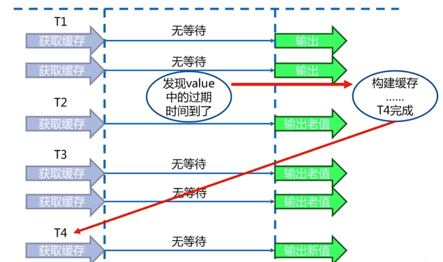


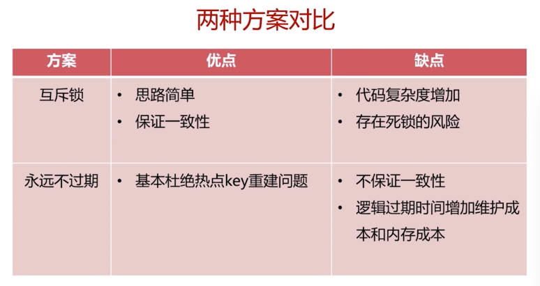

### 过期问题

### 分布式锁

一篇挺不错的文章可以看看[分布式锁简单入门以及三种实现方法][https://blog.csdn.net/xlgen157387/article/details/79036337]

分布式锁应该具备的条件：

1、在分布式系统环境下，一个方法在同一时间只能被一个机器的一个线程执行；  

2、高可用的获取锁与释放锁；  

3、高性能的获取锁与释放锁； 

4、具备可重入特性；  

5、具备锁失效机制，防止死锁； 

6、具备非阻塞锁特性，即没有获取到锁将直接返回获取锁失败。

实现分布式锁的有三种方法：数据库，redis和zookeeper

+ redis有很高的性能
+ redis命令对此支持较好，实现起来比较方便

```
setnx key val
expire key timeout
delete key
```


